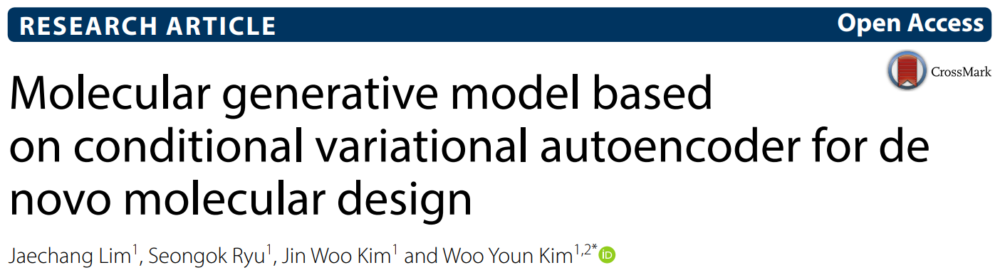

# Conditional VAE for molecular generation (PyTorch)

Reference paper( for the code):

- https://jcheminf.biomedcentral.com/articles/10.1186/s13321-018-0286-7
- https://arxiv.org/abs/1806.05805
- 
- 

Reference papers for CVAE:

- Lim, J., Ryu, S., Kim, J.W. *et al.* Molecular generative model based on conditional variational autoencoder for de novo molecular design. *J Cheminform*  **10** , 31 (2018). https://doi.org/10.1186/s13321-018-0286-7

  - With github of: https://github.com/jaechanglim/CVAE

Reference paper for $\beta$-CVAE:

- Guang Jun, De Tao, Bingquan "Balancing Exploration and Exploitation:
  Disentangled β-CVAE in De Novo Drug Design" (aug 2023)
- https://arxiv.org/abs/2306.01683

Beta term can controll the entagleness of latent space. Making molecules more disentangeled.  of molecules (and stabilize them)

Reference paper for Vae with label prediction:

- "Automatic Chemical Design Using a Data-Driven
  Continuous Representation of Molecules" By Gómez-Bombarelli et al.
  Landmark paper. (2018)
- https://doi.org/10.1021/acscentsci.7b00572

This repository now contains an extended implementation that supports both:

- `lstm` CVAE (paper-style baseline), and
- `transformer` CVAE (an extension).

## What is different from the original paper implementation

 Modifications in this repo include:

(Its a bit of a ship of Theseus situation since so much is changed...)

- Changed from Tensorflow to Pytorch!
- Dual architecture switch in one `CVAE` class: `model_mode = lstm | transformer`.
- Saved training/model recreation config (`training_config.json`) during training.
- Sampling that can auto-load training config from the checkpoint folder (no manual architecture retyping).
- Added $\beta$-annealing to prevent posterior collapse.

  - So this is now a $\beta$-CVAE, based on works by [Nicholas Ang et al](https://arxiv.org/abs/2306.01683)  Who was based on [Higgints et al](https://www.cs.toronto.edu/~bonner/courses/2022s/csc2547/papers/generative/disentangled-representations/beta-vae,-higgins,-iclr2017.pdf).
  - Higher $\beta \implies$strenghtens constraints of latent space to be disentangled (traversable)
  - lower $\beta \implies$greater flexability in the representation.
- A bunch of "tricks of the trade" such as:

  - Lr adjustment on platue
  - dropouts (can prevent overfitting, and increase generalization)
  - weight decay and "adamw" optimizer
  - Ability to use both adam and adamW for optimizer
  - kl annealing holdout and warmup ( so as to disentangle latentspace, and help the unstable transformers.)
  - AMP for increased training speed.
  - Early stopping to prevent overfitting
  - Gaussian sampling
  - Augmentation by resampling (adding multiple instances of non-cannonical smiles for molecules)
    - This is helpfull for the base dataset.
    - 
- Modular config helpers in the `utils/` package for defaults, JSON load/save, and compose-from-overrides.
- Improved generation filtering/reporting in sampling (`unique`, `invalid`, `duplicates`, `in_training`).
- EOS-aware early stopping in decode loop for faster generation. So it does not go trough everything multiple times
- Ability to use only a subset of parameters for conditions compared to the origonal papers which had: MW,LogP, TPSA, HBD, HBA
- Latent memory injection into the Transformer-decoder. This is since the decoder produces sequences conditioned on both *z* and *c.* This means that for each time step, the decoder builds token input from: token embeddings, latent vector z and condition vector c, where both z and c is broadcasted across time steps. Then a memory vector is built and alastly cross-attention is applied in decoder. (a technique studied in the context of  LLMS for Memory injection atacks...)
- Separate prediction head for label predictions, this introduces a $\lambda_l$ term with is a label loss importance coeficent. It also introduces the label loss as **MSE**
- Label prediction head that samples on latent varible, and/or the target vector c. so: p(z,c)
- Oversampling by taking synonyms of the SMILES, to learn the underlying meaning instead of

## The ELBO optimization of $\beta$-CVAE:

$$
logp_\theta(x|z) \ge \mathcal{L}(\theta,\phi,x,z) = \underbrace{\mathbb{E}_{q_\phi(z|x)}[log\underbrace{p_\theta(x|z,c)}_{\text{Conditional likleyhood}}]}_{\text{Reconstruction error (decoder)}}-\beta\underbrace{ D_{KL}[\underbrace{q_\phi(z|x,c)}_{\text{Approximated posterior}}||\underbrace{p(z)}_{\text{prior}}]}_{D_{KL},\text{ Kullback-lieber term (encoder)}} + \underbrace{\lambda_l \mathcal{L}}_{\text{Label head loss (MSE)}}
$$

### In simpler terms:

$$
ELBO \ loss = \text{reconstruction loss} + \beta \times \text{KL (latent loss)} + \text{label loss weigt} \times \text{label loss}
$$

Where:

#### *Random varibles and dist....:*

* x *:* data, observations
* *c* : condition vector can be: LogP, MW.....
* *z*: Latent varible (possible molecule space)
* 

#### Parameters $\phi \ and \ \theta$:

###### $\theta$(decoder/generative parameters):

Parameters on the conditional likleyhood model:

$$
p_\theta(x|z,c)
$$

Decoder network. Givent latent (*z*) and condition *c:* outputs distribution over x. since smiles $\implies$

$$
p_\theta(x|z,c): \\ \text{Factorizes over timesteps as an autoregressice categorial distribution (softmax over tokens/atoms/smiles-letters)}
$$

###### $\phi$ (encoder/ variational parameters):

Tries to approximate the posterior:

$$
q_\phi(z|x,c)
$$

It outputs a distribution over latent varibles *z.*

In this project the prior is assumed to be (conditioned on *c*):

$q(z|x,c) \in {\mathcal{N}(\mu_\phi(x,c),diag(\sigma_\phi^2(x,c)))}$

One has to approximate the posterior since the true posterior: $p(z|x,c)$ is intractable since:

$$
p(z|x,c) = \frac{p(x|z,c)p(z|c)}{\underbrace{p(x|c)}_{\text{intractable}}}
$$

$$
\underbrace{p(x|c)}_{\text{Marginal likleyhood/Evidence }} = \int p(x|z,c) p(z|c)dz
$$

Which would mean having to find the probability of all possible real-latent varible *c*-values (impossible). And especially in the case of smiles where they are discrete....

So the encoder must approximate it, and the approximated posterior is denoted as: $q_\phi(z|x,c)$

## Label-Prediction head:

The labels will be sampeled from latent space: $f(z)$. This head is separate from the decoder. The label head can be toggled to take the target into account. To be able to sucsessfully label the labels one needs an "disentangeled" latentspace. Disentangeled meaning that molecules sharing properties are in distinct "chunk like" areas of the latentspace. This is since an entangeled latentspace could mean that if one samples randomly, eventough the sample lies close to another from the training set, it does not nesecarily imply that they share features and labels (think of it like activitycliffs laying everywhere in propertyspace but this time in latentspace). And to actually disentangle latentspace one can use a larger  $\beta$ term. This is based on research done as mentioned by Guang Jun et al. The labels generated by the label head do have errors in pIC50, so they should be seen more as "fussy" than hard labels.

---

## BACE baseline workflow (pIC50-only conditioning)

This repo now uses a single pipeline entrypoint and a single user-facing config file.

### Single entrypoint + single config

- Entrypoint: `fold_pipeline/run_fold_pipeline.py`
- Config file: `fold_pipeline/fold_pipeline_config.example.json`

Run full CV pipeline from workspace root:

```powershell
python fold_pipeline/run_fold_pipeline.py --config fold_pipeline/fold_pipeline_config.example.json
```

Run one CV iteration only:

```powershell
python fold_pipeline/run_fold_pipeline.py --config fold_pipeline/fold_pipeline_config.example.json --only-fold 0
```

### What the pipeline controls

Per CV iteration the runner controls all stages:

1. Build train/validation split from fold CSVs.
2. Train model (`train_labels.py`) when `train.enabled=true`.
3. Sample generated molecules (`fold_pipeline/sampling_pipeline.py`) when `sampling.enabled=true`.
4. Run analysis in-process from `run_fold_pipeline.py` when `analysis.enabled=true`.

No standalone sampling or standalone analysis config flow is required.

### Keep and edit this config

Use and keep:

```text
fold_pipeline/fold_pipeline_config.example.json
```

Key fields:

- `train_validation_folds_dir`
- `fold_glob`
- `smiles_column`
- `label_columns`
- `training_output_root`
- `artifacts_output_root`
- `train.base_config`
- `sampling.*`
- `analysis.*`

### Sampling target modes (pipeline config)

Set `sampling.target_sampling_mode` to one of:

- `single_target`
- `training_dist`
- `uniform_range`
- `uniform_range_strict`

For pIC50-only workflows, use one-dimensional target ranges/targets in the sampling block.

### Analysis-only and CV-combo modes

Analysis only (reuse generated outputs):

- `train.enabled=false`
- `sampling.enabled=false`
- `analysis.enabled=true`

CV-combo-only plots:

- `cv_combo.enabled=true`
- `cv_combo.only=true`

### Numerical stability notes

- Transformer encoder/decoder blocks run in fp32 under selective autocast when configured, which helps avoid fp16 attention NaNs.
- Reconstruction loss is length-masked so padded tokens do not contribute.
- If Transformer training becomes unstable, set `optimization.use_amp=false` and re-check.

### Notes

- This codebase uses PyTorch checkpoints (`.pt`).
- Keep pipeline orchestration and configuration under `fold_pipeline/` as the primary execution path.
